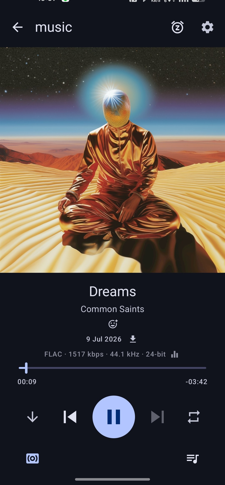
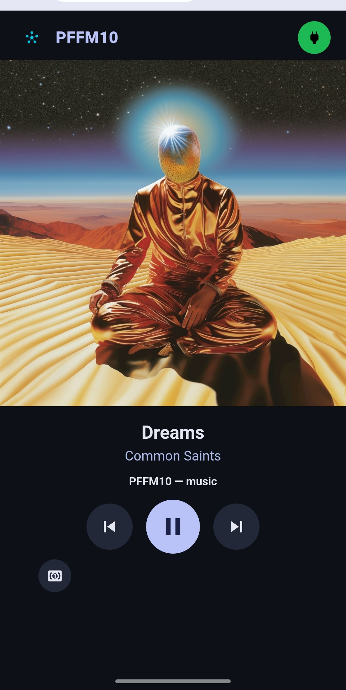
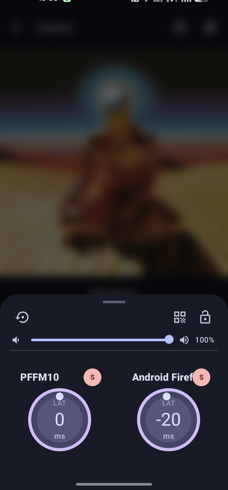
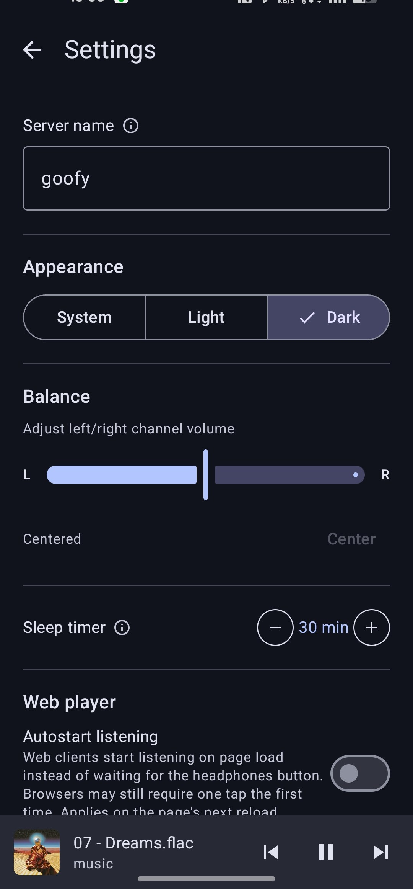

# Telecloud Radio

An Android audio player for Telegram: browse a chat's audio messages as a
playlist, play them with gapless prefetch, and broadcast to any number of
[Snapcast](https://github.com/badaix/snapcast) clients for synchronized
multi-device listening - with a built-in web player for browser clients.

## Screenshots

<p align="center">
  
  
  
  
</p>

Part of the **capullo-tech** audio platform. Telecloud Radio is the Telegram
front-end, being recomposed onto the platform's shared libraries:

- **[capullo-audio](https://github.com/capullo-tech/capullo-audio)** - the
  delivery engine (ExoPlayer → FIFO → Snapcast server/client) and multi-device
  control.
- **[capullo-source-telegram](https://github.com/capullo-tech/capullo-source-telegram)**
  - the Telegram source (TDLib client, download manager, playlist queue) behind
  the `capullo-audio-contracts` SPI.

## Building

```sh
./gradlew :app:assembleDebug
```

TDLib (the client + prebuilt `.so`) comes transitively from the
[`capullo-source-telegram`](https://github.com/capullo-tech/capullo-source-telegram) jitpack
dependency (which depends on [`lib-tdlib-android`](https://github.com/capullo-tech/lib-tdlib-android)).
There's nothing to populate - no `setup_tdlib.sh`, no `git-lfs`.

## License

GPLv3 - see [LICENSE](LICENSE) and [NOTICE](NOTICE).
